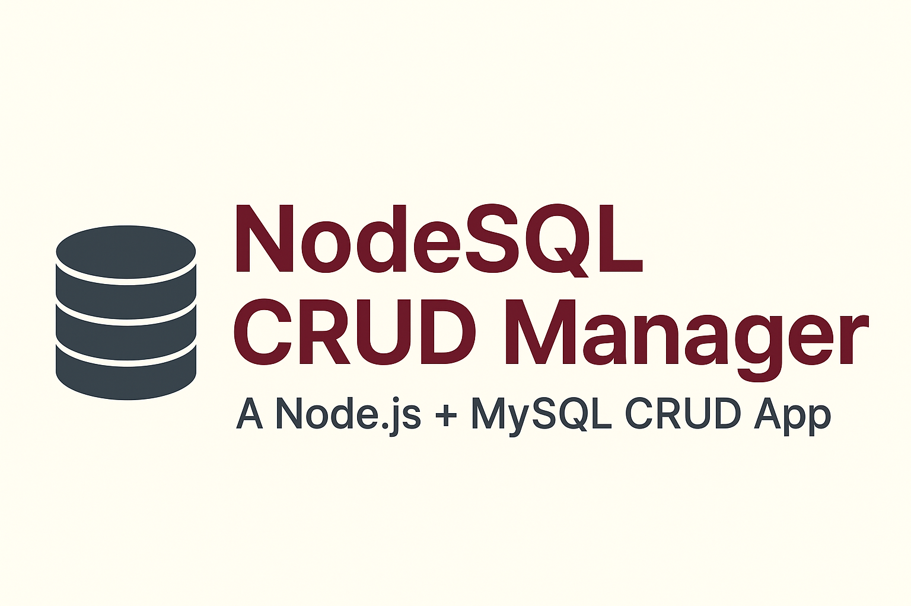

# 🧩 NodeSQL CRUD Manager

A full-stack **Node.js + MySQL** CRUD (Create, Read, Update, Delete) web app built with **Express.js**, **EJS**, and **MySQL2**.  
This project demonstrates how Node.js interacts with SQL databases — including routes, forms, and data manipulation — in a clean and minimal user management system.

---

## 🚀 Features

✅ Add new users  
✅ Display all users  
✅ Edit usernames (with password validation)  
✅ Delete users securely  
✅ Generate random users using Faker.js  
✅ UUID for unique user IDs  

---

## 🧱 Tech Stack

| Layer | Technology |
|-------|-------------|
| Backend | Node.js, Express.js |
| Database | MySQL2 |
| Frontend | EJS Templates |
| Utilities | Faker.js, UUID, Method-Override |

---

## 📂 Folder Structure

SQLCLASS/
├── views/
│ ├── add.ejs # Add new user form
│ ├── delete.ejs # Confirm user deletion
│ ├── edit.ejs # Edit username page
│ ├── home.ejs # Homepage showing total users
│ └── show.ejs # Display all users
│
├── index.js # Main Express app
├── package.json
└── package-lock.json


---

## ⚙️ Setup Instructions

### 1️⃣ Clone the repository
```bash
git clone https://github.com/your-username/node-sql-crud-manager.git
cd node-sql-crud-manager
```

### 2️⃣ Install dependencies
npm install

### 3️⃣ Create a MySQL Database

Open MySQL and run:

CREATE DATABASE delta_app;

### 4️⃣ Start the server
node index.js

Then visit 👉 http://localhost:8080

## 💡 Learning Highlights

How Node.js communicates with MySQL databases

Using EJS for server-rendered pages

Implementing RESTful routes

Using method-override for PATCH/DELETE support

Structuring full CRUD logic with Express

## 📸 Screenshots




## 💬 Connect With Me

👨‍💻 [**Mohd Almas**](https://github.com/CodeByAlmas)
🔗 [**LinkedIn**](https://www.linkedin.com/in/mohd-almas-9ab9a6235/)
📧 Email: mohd2almas321@gmail.com

⭐ If you found this useful, please give it a Star on GitHub — it motivates me to keep learning and building!

## 🏷️ Keywords

Node.js · Express · MySQL · CRUD · EJS · Full Stack · Faker.js · UUID